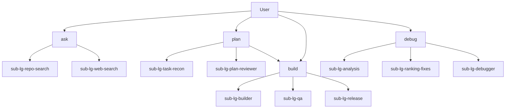

# OpenCode Project Setup

This repository defines a transparent agent and subagent architecture in `opencode.json`.

Context profiles and slash-command templates are intentionally removed from configuration for now.

## Agent Structure

Naming convention:

- Primary agents use unprefixed canonical names: `ask`, `plan`, `build`, `debug`.
- Subagents use the `sub-<type>-` prefix.
- Supported subagent types: `lg` (LangGraph pipeline subagents), `cr` (CrewAI persona subagents).

Primary agents:

- `ask` - Information router that chooses between repository-grounded and external-source retrieval and returns source-tagged answers.
- `plan` - Planning orchestrator that runs fast task reconnaissance, asks only essential clarification questions, and can harden higher-risk plans before optional handoff to `build`.
- `build` - Delivery orchestrator for implementation, QA validation, and release readiness checks.
- `debug` - Debug orchestrator for hypothesis analysis, fix ranking, and concrete remediation output.

Subagents:

- `sub-lg-repo-search` - Use for repository-grounded questions; return file-cited answers with confidence and no non-read actions.
- `sub-lg-web-search` - Use for external docs/standards; return cited links and concise synthesis; ask for confirmation before `edit`, `bash`, or state-changing delegation.
- `sub-lg-task-recon` - Gather implementation-planning inputs quickly by extracting knowns, unknowns, assumptions, and targeted clarification questions.
- `sub-lg-task-lister` - Decompose approved goals into actionable tasks with stable IDs and done criteria.
- `sub-lg-dependency-mapper` - Map task dependencies, critical path, and parallelizable execution groups.
- `sub-lg-crew-manager` - Match planned tasks to available `sub-cr-*` specialists and return delegation recommendations with fallbacks.
- `sub-lg-validation-planner` - Define task-level validation gates, evidence expectations, and regression checks.
- `sub-lg-plan-state-writer` - Persist execution-ready plans into markdown state files used as `build` execution monitors.
- `sub-lg-plan-reviewer` - Harden plans by identifying assumption gaps, risk severity, and missing verification.
- `sub-cr-terraform-engineer` - CrewAI persona specialist for Terraform planning, risk controls, and IaC validation expectations.
- `sub-lg-builder` - Implement approved changes and report what changed, why, and how it was verified.
- `sub-lg-qa` - Validate changed behavior; report pass/fail checks, defects, repro steps, and quality risk.
- `sub-lg-release` - Assess release readiness with blockers-first output for versioning, env, rollout, rollback, and monitoring.
- `sub-lg-analysis` - Start debug by modeling symptoms, repro assumptions, and probable failure domains.
- `sub-lg-ranking-fixes` - Prioritize remedy options by confidence, impact, effort, and risk with a recommended path.
- `sub-lg-debugger` - Finalize root cause and provide implementation-ready fix steps with expected outcomes and regression checks.

## Delegation Order (Convention)

- `ask` typically routes: `sub-lg-repo-search` first for project-specific queries, then `sub-lg-web-search` if external evidence is needed.
- `plan` typically routes: `sub-lg-task-recon` -> optional `sub-lg-plan-reviewer` -> optional `build` handoff on explicit user approval.
- `build` typically routes: `sub-lg-builder` -> `sub-lg-qa` -> `sub-lg-release`.
- `debug` typically routes: `sub-lg-analysis` -> `sub-lg-ranking-fixes` -> `sub-lg-debugger`.
- Routing order is a convention; hard enforcement remains permission-based.

## Routing Diagram

## Policy Highlights

- `ask` can delegate only to `sub-lg-repo-search` and `sub-lg-web-search`.
- `plan` can delegate to `sub-lg-task-recon`, `sub-lg-plan-reviewer`, and `build`.
- `sub-lg-crew-manager` uses explicit allowlist-based delegation to `sub-cr-*` specialists.
- `build` can delegate only to `sub-lg-builder`, `sub-lg-qa`, and `sub-lg-release`.
- `debug` can delegate only to `sub-lg-analysis`, `sub-lg-ranking-fixes`, and `sub-lg-debugger`.
- `sub-lg-web-search` is confirmation-gated for any non-read action.
- `sub-lg-debugger` is fix-capable and can provide implementation-ready remediation steps.

## Repository Layout

- `opencode.json` - Models, provider settings, and runtime defaults.
- `agents/` - Source-of-truth markdown agent definitions (one file per agent).
- `README.md` - Architecture overview and routing diagram.
- `auth.example.json` - Template for OpenCode credentials file (`~/.local/share/opencode/auth.json`).

## Local Auth Setup

1. Recommended: run `/connect` in OpenCode to store credentials automatically.
2. Manual option: copy `auth.example.json` to `~/.local/share/opencode/auth.json`.
3. Edit `~/.local/share/opencode/auth.json` and replace `[YOUR_API_KEY]` with your real key.

## Quick Setup Script

1. Open `setup.sh`.
2. Run `./setup.sh`, choose scope (`project`, `global`, or `both`), and enter values when prompted.
3. The script installs OpenCode first if it is missing (tries `brew`, `npm`, `bun`, `pnpm`, then `yarn`).
4. Optional non-interactive mode: `SCOPE=both API_KEY=your_key RESOURCE_NAME=your_resource_name ./setup.sh`.
5. The script creates `~/.local/share/opencode/auth.json` with your Azure API key.
6. For `SCOPE=project`, it updates `./opencode.json` with `provider.azure.options.resourceName`.
7. For `SCOPE=global`, it updates `~/.config/opencode/opencode.json` (or `$XDG_CONFIG_HOME/opencode/opencode.json`).
8. For `SCOPE=both`, it updates both files so project config does not override global config.
9. If `provider.azure.options.resourceName` is already set in the selected config, the script asks whether to reuse it.
10. The script overwrites Azure `provider.azure.options` in the selected scope(s), replacing old endpoint/baseURL-style settings with the chosen `resourceName`.
11. If an Azure API key already exists in `~/.local/share/opencode/auth.json`, the script asks whether to reuse it or enter a new one.
12. For non-interactive runs with an existing key, set `USE_EXISTING_KEY=yes` to reuse or `USE_EXISTING_KEY=no` to force entering `API_KEY`.
13. For scopes that include global setup, the script asks whether to copy repository agents into the global agents directory.
14. If global agent deployment is selected, the script can optionally clean existing global `*.md` agent files before copying.
15. In non-interactive mode, control these prompts with `USE_EXISTING_RESOURCE_NAME=yes|no`, `COPY_REPO_AGENTS_TO_GLOBAL=yes|no`, and `CLEAN_GLOBAL_AGENTS=yes|no`.
16. If global agent copy is declined, the script still configures auth and Azure resource name settings.
17. During deployment, deprecated primary files (`pri-ask.md`, `pri-plan.md`, `pri-build.md`, `pri-debug.md`) are removed from target agent directories so menu surfaces do not retain dual old/new primary entries.
