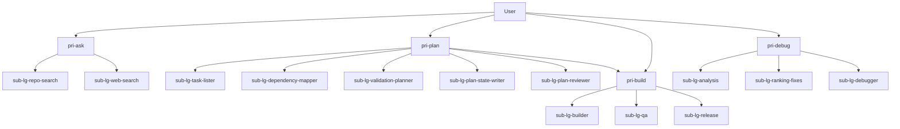

# OpenCode Project Setup

This repository defines a transparent agent and subagent architecture in `opencode.json`.

Context profiles and slash-command templates are intentionally removed from configuration for now.

## Agent Structure

Naming convention:

- Primary agents use the `pri-` prefix.
- Subagents use the `sub-<type>-` prefix.
- Supported subagent types: `lg` (LangGraph pipeline subagents), `cr` (CrewAI persona subagents; reserved for future use).

Primary agents:

- `pri-ask` - Information router that chooses between repository-grounded and external-source retrieval and returns source-tagged answers.
- `pri-plan` - Planning orchestrator that decomposes tasks, maps dependencies, defines validation, writes plan-state markdown, and can hand off to `pri-build` on user approval.
- `pri-build` - Delivery orchestrator for implementation, QA validation, and release readiness checks.
- `pri-debug` - Debug orchestrator for hypothesis analysis, fix ranking, and concrete remediation output.

Subagents:

- `sub-lg-repo-search` - Use for repository-grounded questions; return file-cited answers with confidence and no non-read actions.
- `sub-lg-web-search` - Use for external docs/standards; return cited links and concise synthesis; ask for confirmation before `edit`, `bash`, or state-changing delegation.
- `sub-lg-task-lister` - Decompose approved goals into actionable tasks with stable IDs and done criteria.
- `sub-lg-dependency-mapper` - Map task dependencies, critical path, and parallelizable execution groups.
- `sub-lg-validation-planner` - Define task-level validation gates, evidence expectations, and regression checks.
- `sub-lg-plan-state-writer` - Persist execution-ready plans into markdown state files used as `pri-build` execution monitors.
- `sub-lg-plan-reviewer` - Harden plans by identifying assumption gaps, risk severity, and missing verification.
- `sub-lg-builder` - Implement approved changes and report what changed, why, and how it was verified.
- `sub-lg-qa` - Validate changed behavior; report pass/fail checks, defects, repro steps, and quality risk.
- `sub-lg-release` - Assess release readiness with blockers-first output for versioning, env, rollout, rollback, and monitoring.
- `sub-lg-analysis` - Start debug by modeling symptoms, repro assumptions, and probable failure domains.
- `sub-lg-ranking-fixes` - Prioritize remedy options by confidence, impact, effort, and risk with a recommended path.
- `sub-lg-debugger` - Finalize root cause and provide implementation-ready fix steps with expected outcomes and regression checks.

## Delegation Order (Convention)

- `pri-ask` typically routes: `sub-lg-repo-search` first for project-specific queries, then `sub-lg-web-search` if external evidence is needed.
- `pri-plan` typically routes: `sub-lg-task-lister` -> `sub-lg-dependency-mapper` -> `sub-lg-validation-planner` -> `sub-lg-plan-state-writer` -> `sub-lg-plan-reviewer` -> optional `pri-build` handoff on explicit user approval.
- `pri-build` typically routes: `sub-lg-builder` -> `sub-lg-qa` -> `sub-lg-release`.
- `pri-debug` typically routes: `sub-lg-analysis` -> `sub-lg-ranking-fixes` -> `sub-lg-debugger`.
- Routing order is a convention; hard enforcement remains permission-based.

## Routing Diagram

## Policy Highlights

- `pri-ask` can delegate only to `sub-lg-repo-search` and `sub-lg-web-search`.
- `pri-plan` can delegate to `sub-lg-task-lister`, `sub-lg-dependency-mapper`, `sub-lg-validation-planner`, `sub-lg-plan-state-writer`, `sub-lg-plan-reviewer`, and `pri-build`.
- `pri-build` can delegate only to `sub-lg-builder`, `sub-lg-qa`, and `sub-lg-release`.
- `pri-debug` can delegate only to `sub-lg-analysis`, `sub-lg-ranking-fixes`, and `sub-lg-debugger`.
- `sub-lg-web-search` is confirmation-gated for any non-read action.
- `sub-lg-debugger` is fix-capable and can provide implementation-ready remediation steps.

## Repository Layout

- `opencode.json` - Models, provider settings, and runtime defaults.
- `agents/` - Source-of-truth markdown agent definitions (one file per agent).
- `README.md` - Architecture overview and routing diagram.
- `auth.example.json` - Template for OpenCode credentials file (`~/.local/share/opencode/auth.json`).

## Local Auth Setup

1. Recommended: run `/connect` in OpenCode to store credentials automatically.
2. Manual option: copy `auth.example.json` to `~/.local/share/opencode/auth.json`.
3. Edit `~/.local/share/opencode/auth.json` and replace `[YOUR_API_KEY]` with your real key.

## Quick Setup Script

1. Open `setup.sh`.
2. Run `./setup.sh`, choose scope (`project`, `global`, or `both`), and enter values when prompted.
3. The script installs OpenCode first if it is missing (tries `brew`, `npm`, `bun`, `pnpm`, then `yarn`).
4. Optional non-interactive mode: `SCOPE=both API_KEY=your_key RESOURCE_NAME=your_resource_name ./setup.sh`.
5. The script creates `~/.local/share/opencode/auth.json` with your Azure API key.
6. For `SCOPE=project`, it updates `./opencode.json` with `provider.azure.options.resourceName`.
7. For `SCOPE=global`, it updates `~/.config/opencode/opencode.json` (or `$XDG_CONFIG_HOME/opencode/opencode.json`).
8. For `SCOPE=both`, it updates both files so project config does not override global config.
9. The script overwrites Azure `provider.azure.options` in the selected scope(s), replacing old endpoint/baseURL-style settings with the chosen `resourceName`.
10. If an Azure API key already exists in `~/.local/share/opencode/auth.json`, the script asks whether to reuse it or enter a new one.
11. For non-interactive runs with an existing key, set `USE_EXISTING_KEY=yes` to reuse or `USE_EXISTING_KEY=no` to force entering `API_KEY`.
12. The script deploys agent markdown files from `./agents` to `.opencode/agents/` (project) and/or `~/.config/opencode/agents/` (global) based on `SCOPE`.
13. Agent deployment is safe: only matching file names are overwritten; unrelated custom agent files are preserved.
