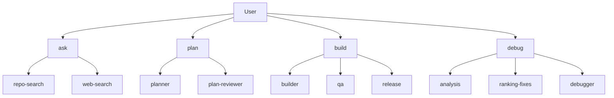

# OpenCode Project Setup

This repository defines a transparent agent and subagent architecture in `opencode.json`.

Context profiles and slash-command templates are intentionally removed from configuration for now.

## Agent Structure

Primary agents:

- `ask` - Information router that chooses between repository-grounded and external-source retrieval and returns source-tagged answers.
- `plan` - Planning orchestrator that converts goals into phased, review-hardened execution plans.
- `build` - Delivery orchestrator for implementation, QA validation, and release readiness checks.
- `debug` - Debug orchestrator for hypothesis analysis, fix ranking, and concrete remediation output.

Subagents:

- `repo-search` - Use for repository-grounded questions; return file-cited answers with confidence and no non-read actions.
- `web-search` - Use for external docs/standards; return cited links and concise synthesis; ask for confirmation before `edit`, `bash`, or state-changing delegation.
- `planner` - Build phased plans with dependencies, impact map, risks, and validation strategy.
- `plan-reviewer` - Harden plans by identifying assumption gaps, risk severity, and missing verification.
- `builder` - Implement approved changes and report what changed, why, and how it was verified.
- `qa` - Validate changed behavior; report pass/fail checks, defects, repro steps, and quality risk.
- `release` - Assess release readiness with blockers-first output for versioning, env, rollout, rollback, and monitoring.
- `analysis` - Start debug by modeling symptoms, repro assumptions, and probable failure domains.
- `ranking-fixes` - Prioritize remedy options by confidence, impact, effort, and risk with a recommended path.
- `debugger` - Finalize root cause and provide implementation-ready fix steps with expected outcomes and regression checks.

## Delegation Order (Convention)

- `ask` typically routes: `repo-search` first for project-specific queries, then `web-search` if external evidence is needed.
- `plan` typically routes: `planner` -> `plan-reviewer`.
- `build` typically routes: `builder` -> `qa` -> `release`.
- `debug` typically routes: `analysis` -> `ranking-fixes` -> `debugger`.
- Routing order is a convention; hard enforcement remains permission-based.

## Routing Diagram

## Policy Highlights

- `ask` can delegate only to `repo-search` and `web-search`.
- `plan` can delegate only to `planner` and `plan-reviewer`.
- `build` can delegate only to `builder`, `qa`, and `release`.
- `debug` can delegate only to `analysis`, `ranking-fixes`, and `debugger`.
- `web-search` is confirmation-gated for any non-read action.
- `debugger` is fix-capable and can provide implementation-ready remediation steps.

## Repository Layout

- `opencode.json` - Models, provider settings, agents, subagents, and policy permissions.
- `README.md` - Architecture overview and routing diagram.
- `auth.example.json` - Template for OpenCode credentials file (`~/.local/share/opencode/auth.json`).

## Local Auth Setup

1. Recommended: run `/connect` in OpenCode to store credentials automatically.
2. Manual option: copy `auth.example.json` to `~/.local/share/opencode/auth.json`.
3. Edit `~/.local/share/opencode/auth.json` and replace `[YOUR_API_KEY]` with your real key.

## Quick Setup Script

1. Open `setup.sh`.
2. Run `./setup.sh`, choose scope (`project` or `global`), and enter values when prompted.
3. The script installs OpenCode first if it is missing (tries `brew`, `npm`, `bun`, `pnpm`, then `yarn`).
4. Optional non-interactive mode: `SCOPE=project API_KEY=your_key RESOURCE_NAME=your_resource_name ./setup.sh`.
5. The script creates `~/.local/share/opencode/auth.json` with your Azure API key.
6. For `SCOPE=project`, it updates `./opencode.json` with `provider.azure.options.resourceName`.
7. For `SCOPE=global`, it updates `~/.config/opencode/opencode.json` (or `$XDG_CONFIG_HOME/opencode/opencode.json`).
8. If an Azure API key already exists in `~/.local/share/opencode/auth.json`, you can run the script with just `RESOURCE_NAME` and it will reuse the saved key.
